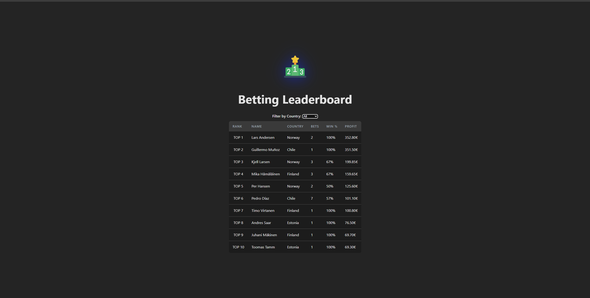

# Betting Leaderboard 🏆

A full-stack web application for tracking and displaying the top-performing betting customers based on their win rates, profit, and activity. Built with **TypeScript**, **React**, **Node.js**, **Express**, and **PostgreSQL**, the project features a modern architecture with clean separation of concerns and real-time leaderboard capabilities.

## ✨ Features

* ⚡ Fast and responsive frontend using **Vite** and **React**
* 📊 Dynamic leaderboard sorted by **profit**
* 🌍 Filter by **customer country**
* ✅ Calculated metrics: **total bets**, **win percentage**, and **net profit**
* 🔌 REST API built with **Express** and **TypeScript**
* 🗃️ SQL queries using **Knex.js** for portability and maintainability
* 🐳 Easy local PostgreSQL setup via **Docker**
* 🔧 Clean, modular, and scalable codebase

## 🖥️ Tech Stack

### **Frontend**
* React.js
* TypeScript
* Vite

### **Backend**
* Node.js
* Express
* TypeScript
* Knex.js
* PostgreSQL

## 🚀 Getting Started

### 1. Prerequisites
* Node.js & NPM
* Docker (optional, for easy PostgreSQL setup)

### 2. Set up the PostgreSQL Database
To quickly spin up a local PostgreSQL instance using Docker:

```bash
docker run --name leaderboard-postgres -e POSTGRES_PASSWORD=password -p 5432:5432 -d postgres
```

Or use your own local setup if preferred.

### 3. Run the Backend (Server)

```bash
cd server
npm install
npm run build # Compiles TypeScript
npm run dev # Start in development mode
# OR
npm run build && npm start # Start in production mode
```

Backend will be available at: http://localhost:3000  
API Endpoint: GET /customers

### 4. Run the Frontend (Client)

```bash
cd client
npm install
npm run dev
```

Frontend will be available at: http://localhost:5173

## 🧠 Leaderboard Logic

### What qualifies as a valid bet?
* Only `WON` and `LOST` statuses are considered
* `PENDING` bets are ignored

### Displayed Fields
* Full name
* Country
* Total bets (excluding pending)
* Win percentage
* Profit = Net wins − Total lost stake

### Example Profit Calculation
A customer has made the following five bets:

| Bet | Stake (€) | Odds | Status |
|-----|-----------|------|--------|
| 1 | 2 | 4 | WON |
| 2 | 5 | 2.2 | LOST |
| 3 | 10 | 2.6 | WON |
| 4 | 5 | 1.3 | PENDING |
| 5 | 15 | 2.1 | LOST |

**Net win:** ((2×4)−2) + ((10×2.6)−10) = 6 + 16 = **22**  
**Loss:** 5 + 15 = **20**  
**Profit:** 22 − 20 = **€2**

Customers with **negative profit** are excluded from the leaderboard.

## 📁 Project Structure

```
/client          → React frontend
/server          → Node.js backend API
  └─ src
    └─ db
      ├─ migrations
      ├─ seeds
      └─ queries
```

## 📸 Screenshots
*(Optional: Add UI screenshots here to visualize leaderboard, filters, etc.)*


## 📬 Contact
https://www.linkedin.com/in/arturaarma/

